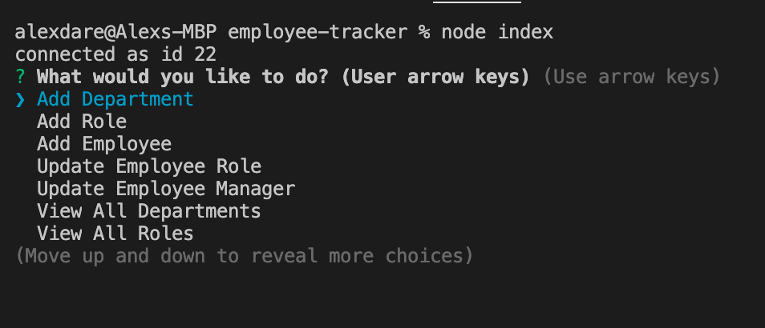
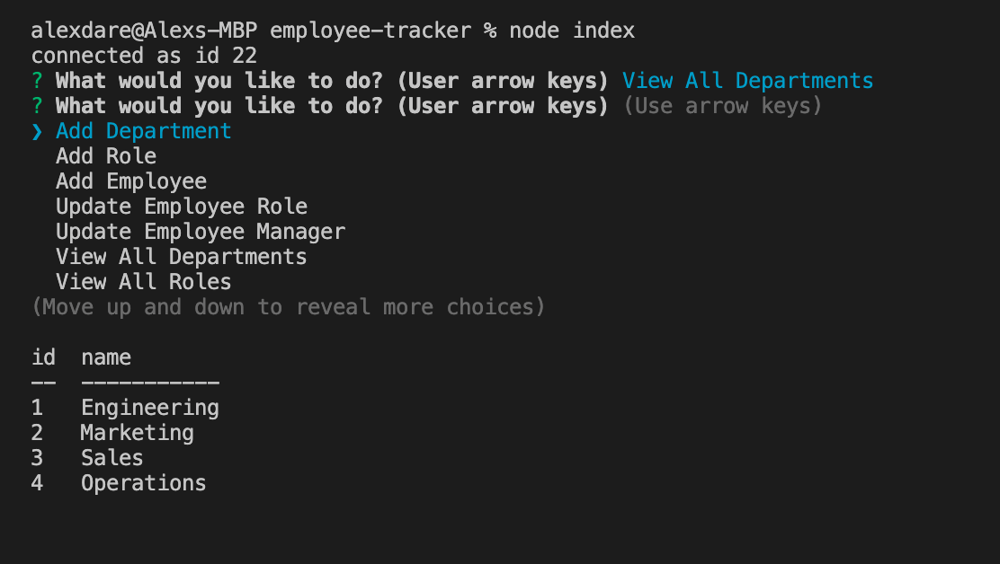
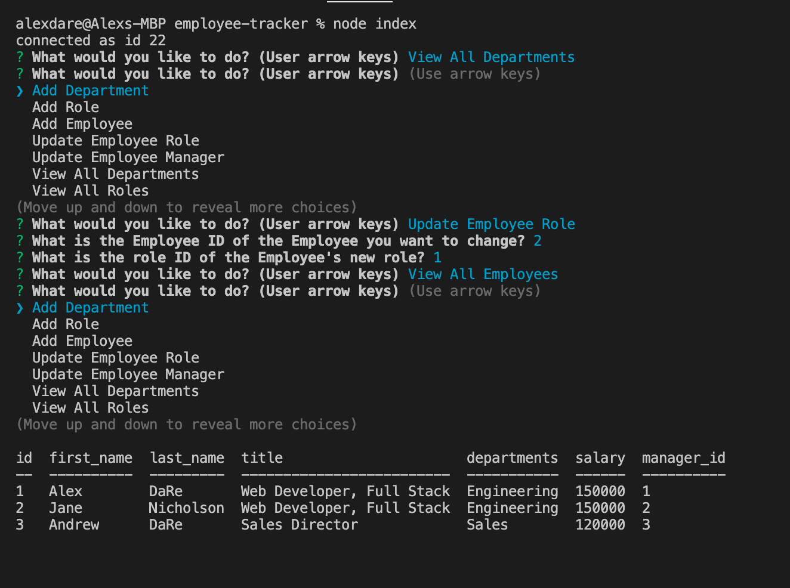

# Employee Tracker CLI Application

This application allows for adding and editing employees, managers, department and roles in a command line appliacation. There is no deployed URL to view this application as it appears in the command line. To use this on your local machine:
1. Download the application from [Github](https://github.com/aldare93/book-search-engine)
2. Open the command line and run `NPM Install` to install the necesary dependencies (Inquirer, mysql, console.table)
3. In the command line run `node index.js`.

Here's a [video](https://drive.google.com/file/d/1h2iCfnmek_zDJS7piNgclY1XOKTh43dS/view) of the application in use.

